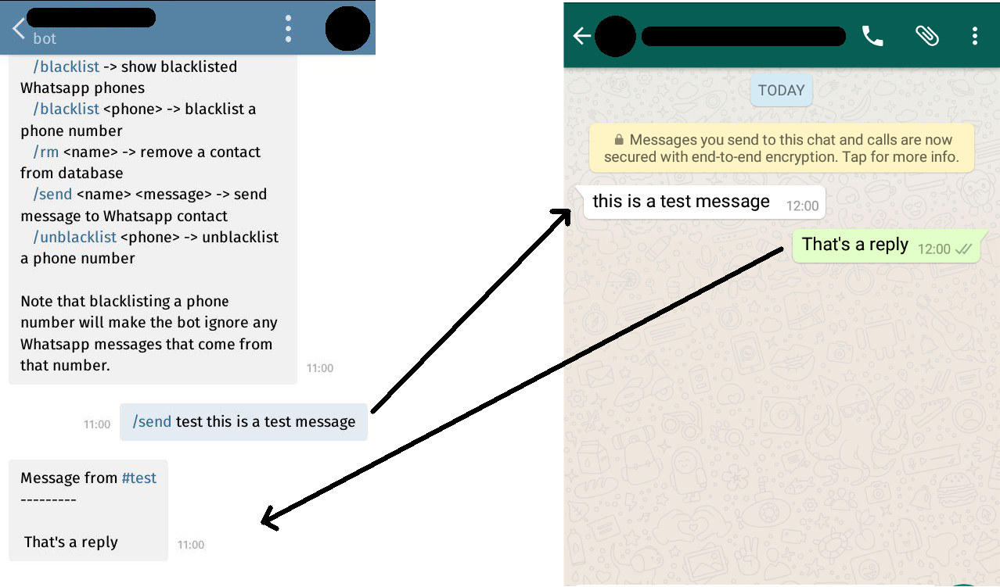

# wat-bridge

[](https://gitter.im/wat-bridge/Lobby)

A bridge between WhatsApp and Telegram.

This creates two listeners, one for WhatsApp and another for a Telegram bot. When the WhatsApp listener receives a message it relays the content to the Telegram bot, which sends it to the owner. In order to send a message to WhatsApp, the owner must do so through the Telegram bot.

**IMPORTANT WARNING:** it is possible that WhatApp will end up blocking the phone number used to connect through yowsup, **use at your own risk**.

## Usage

```
$ virtualenv -p python3 venv
$ . venv/bin/activate
$ pip install -r requirements.txt
$ WAT_CONF=path_to_conf_file python watbridge.py
```

**NOTE:** For some reason, yowsup has issues when receiving messages. The workaround mentioned at <https://github.com/tgalal/yowsup/issues/1613#issuecomment-247801568> works, so instead of installing yowsup from requirements, use:

```
$ pip install -U git+https://github.com/tawanda/yowsup.git
```

## Configuration

```conf
[tg]
owner = ONWER_ID
token = TOKEN

[wa]
phone = PHONE_NUMBER
password = PASSWORD

[db]
path = PATH_TO_DB
```

The Telegram token is obtained by talking to the *BotFather* through Telegram and creating a bot, while the owner ID can be obtained by using the `/me` command.

The WhatsApp phone must include the country code (without any additional characters such as `+`, only the digits) followed by the number, for instance `49xxxxxxxxx`, and the password can be obtained through the [Yowsup cli interface](https://github.com/tgalal/yowsup/wiki/yowsup-cli-2.0).

Lastly, the database path is the full path to the file that will contain blacklist and contacts. Note that this path should be readable/writable by the user that executes the application.

## Simulate different chats

By default, communication with WhatsApp contacts is done through the **chat with the Telegram bot** (ie. using the `/send <user> <msg>` command). It is possible to simulate having different conversations with WhatsApp contacts by using **empty group chats in Telegram**. This works as follows:

1. Create an empty group chat
2. Invite the Telegram bot to the empty chat
3. Get chat id with the `/me` command
4. Bind a WhatsApp contact to the group with `/bind <contact name> <group id>`, where `<group id>` is the id obtained in **step 3**

Now every message sent to that group will be relayed to the bound WhatsApp contact automatically and all the messages the WhatsApp bot receives from that contact will be send to the bound Telegram group.

## Example



## License

This code is released under the MIT license (see LICENSE).

```
THE SOFTWARE IS PROVIDED "AS IS", WITHOUT WARRANTY OF ANY KIND, EXPRESS OR
IMPLIED, INCLUDING BUT NOT LIMITED TO THE WARRANTIES OF MERCHANTABILITY,
FITNESS FOR A PARTICULAR PURPOSE AND NONINFRINGEMENT. IN NO EVENT SHALL THE
AUTHORS OR COPYRIGHT HOLDERS BE LIABLE FOR ANY CLAIM, DAMAGES OR OTHER
LIABILITY, WHETHER IN AN ACTION OF CONTRACT, TORT OR OTHERWISE, ARISING FROM,
OUT OF OR IN CONNECTION WITH THE SOFTWARE OR THE USE OR OTHER DEALINGS IN THE
SOFTWARE.
```
